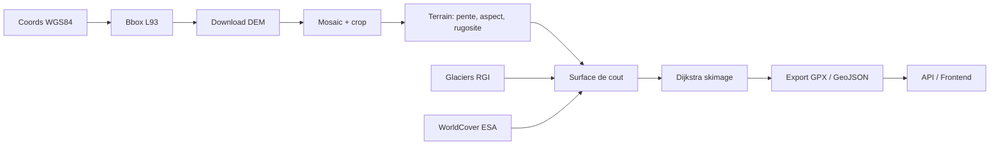

# Architecture

## Vue d'ensemble

AlpineRoute prend deux coordonnees GPS (depart, arrivee) et calcule l'itineraire optimal hors-sentier en montagne. Le principe : le DEM raster est utilise directement comme graphe implicite (grille 8-connectee), chaque pixel porte un cout de traversee calcule a partir de la topographie, des glaciers et de la couverture du sol. Dijkstra trouve le chemin de cout minimal, qui est ensuite exporte en GPX/GeoJSON.

## Pipeline

## Modules

Le code backend est dans `backend/alpineroute/` :

| Module | Fichier(s) | Role |
|--------|-----------|------|
| `config` | `config.py` | Constantes et parametres du pipeline. Aucune constante magique dans les autres modules. |
| `utils` | `utils.py` | I/O raster (load/save), reprojection, calcul de stats de trajet, exceptions custom. |
| `dem/download` | `dem/download.py` | Telechargement dalles IGN via WFS/WMS-R, fallback Copernicus GLO-30, mosaic avec rasterio. |
| `dem/terrain` | `dem/terrain.py` | Pente et aspect (Horn's method via scipy.ndimage.convolve), rugosite TRI 3x3. |
| `cost/surface` | `cost/surface.py` | Facteurs de cout individuels (Tobler, hypoxie, aspect, glacier, rugosite) et assemblage multiplicatif. |
| `cost/landcover` | `cost/landcover.py` | Integration WorldCover ESA : lecture /vsicurl/, reprojection L93, multiplicateurs par classe. |
| `routing/pathfinding` | `routing/pathfinding.py` | Preparation de la grille (nodata -> inf) et lancement de `skimage.graph.route_through_array`. |
| `routing/export` | `routing/export.py` | Export GPX (gpxpy) et GeoJSON 3D, simplification Douglas-Peucker. |
| `api/main` | `api/main.py` | App FastAPI : endpoints /health, /info, /calculate, /calculate-async, /progress/{job_id} (SSE). |
| `api/models` | `api/models.py` | Schemas Pydantic (RouteRequest, HealthResponse). |
| `db/schema` | `db/schema.py` | Schema SQLite : tables routes, user_zones, dem_cache, preferences. |
| `db/crud` | `db/crud.py` | Operations CRUD : sauvegarde de routes, gestion cache DEM. |

## Choix techniques

### Grille implicite, pas de graphe explicite

Le DEM est directement utilise comme grille de cout 8-connectee. Un DEM de 5000x5000 pixels contient 25 millions de noeuds. Construire un graphe explicite (NetworkX) prendrait des dizaines de Go de RAM et des heures. `skimage.graph.route_through_array` utilise un Dijkstra en Cython qui opere directement sur le tableau NumPy.

### scipy.ndimage pour le terrain

Les calculs de pente (Horn's method) et de rugosite (TRI) utilisent `scipy.ndimage.convolve`. Pas besoin de richdem ou GDAL Python pour ca : les kernels sont simples, la precision est equivalente, et ca evite une dependance supplementaire.

### SQLite

Suffisant pour un usage mono-utilisateur. Pas besoin de PostgreSQL + PostGIS pour la V1. Le schema stocke les routes calculees, les zones utilisateur et le cache DEM.

### FastAPI + SSE

Le calcul de route peut prendre 10-30 secondes sur des grandes zones. Le endpoint `/calculate-async` lance le calcul dans un thread et renvoie un `job_id`. Le client suit la progression via SSE sur `/progress/{job_id}`. SSE plutot que WebSocket : plus simple, passe mieux les proxies, unidirectionnel suffit ici.

### Lambert-93 comme CRS de travail

Toutes les operations raster se font en EPSG:2154 (Lambert-93). C'est le CRS natif des donnees IGN, il est metrique (pas besoin de convertir les distances), et ca evite les distorsions de surface aux latitudes alpines. La conversion WGS84 se fait uniquement en entree/sortie.
