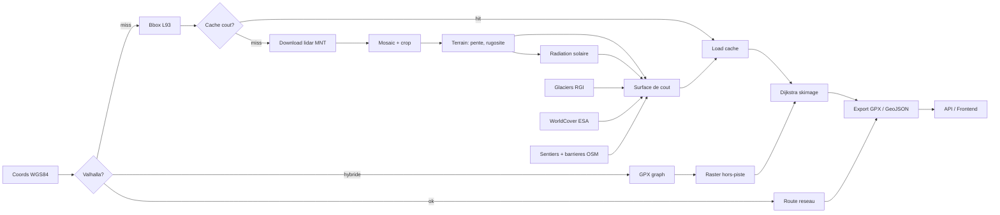

# Architecture

## Vue d'ensemble

AlpineRoute prend 2 coordonnées GPS (départ, arrivée) et calcule l'itinéraire optimal en montagne. Le routage est adaptatif : si un réseau routier/sentier existe (via Valhalla), il est utilisé pour les portions sur sentier. Les sections hors-piste sont calculées sur une grille lidar MNT implicite (8-connectée) où le coût de chaque pixel dépend de la topographie, des glaciers et de la couverture du sol.

## Stratégies de routage

Le pipeline détecte automatiquement la meilleure stratégie :

- **Reseau** : départ et arrivée proches du réseau OSM. Valhalla gère tout, pas de calcul raster.
- **Hybride** : approche par le réseau OSM (Valhalla), puis section hors-piste sur grille lidar. Peut aussi passer par le graphe GPX (traces alpinisme indexées) si des portails existent dans le corridor.
- **Raster** : pathfinding complet sur grille lidar MNT. Fallback quand Valhalla est indisponible ou que les points sont loin du réseau.

## Pipeline

## Modules

Le code backend est dans `backend/alpineroute/` :

| Module | Fichier(s) | Role |
|--------|-----------|------|
| `config` | `config.py` | Constantes et parametres du pipeline. Aucune constante magique dans les autres modules. |
| `utils` | `utils.py` | I/O raster, reprojection, stats de trajet, exceptions custom. |
| `pipeline` | `pipeline.py` | Orchestration du calcul : selection strategie, enchainement etapes, progression SSE. |
| `dem/download` | `dem/download.py` | Telechargement dalles IGN via WFS/WMS-R, fallback Copernicus GLO-30, mosaic rasterio. |
| `dem/terrain` | `dem/terrain.py` | Pente et aspect (Horn's method via scipy), rugosite TRI 3x3. |
| `cost/surface` | `cost/surface.py` | Facteurs de cout individuels (Tobler, hypoxie, radiation, glacier, rugosite, hillslope) et assemblage multiplicatif. |
| `cost/cache` | `cost/cache.py` | Cache surface de cout. Cle = sha256(bbox+res+mois), stockage npz + JSON sidecar, TTL 90j. |
| `cost/radiation` | `cost/radiation.py` | Radiation solaire : position NOAA, horizons vectorises, ombres portees, irradiance directe. |
| `cost/landcover` | `cost/landcover.py` | WorldCover ESA : lecture /vsicurl/, reprojection L93, multiplicateurs par classe. |
| `cost/trails` | `cost/trails.py` | Sentiers OSM : dl Overpass, classification 12 niveaux, rasterisation sur grille lidar. |
| `cost/barriers` | `cost/barriers.py` | Barrieres OSM : rivieres/autoroutes infranchissables, detection ponts. |
| `routing/pathfinding` | `routing/pathfinding.py` | Preparation grille et `skimage.graph.route_through_array`. |
| `routing/network` | `routing/network.py` | Client Valhalla : route, locate, status. |
| `routing/hybrid` | `routing/hybrid.py` | Assemblage route hybride : segments Valhalla + raster. |
| `routing/gpx_graph` | `routing/gpx_graph.py` | Graphe topologique des traces GPX, portails vers le reseau OSM. |
| `routing/export` | `routing/export.py` | Export GPX (gpxpy) et GeoJSON 3D, simplification Douglas-Peucker. |
| `alpine/index` | `alpine/index.py` | Indexation traces GPX depuis index.json, sync SQLite. |
| `alpine/routes` | `alpine/routes.py` | Parsing GPX, conversion GeoJSON, cotations. |
| `api/main` | `api/main.py` | App FastAPI : endpoints calcul, routes, zones, admin, glaciers. |
| `api/models` | `api/models.py` | Schemas Pydantic (RouteRequest, ZoneCreate, etc.). |
| `db/schema` | `db/schema.py` | Schema SQLite : tables routes, zones, alpine_routes, terrain_segments. |
| `db/crud` | `db/crud.py` | Operations CRUD routes et zones. |

## Choix techniques

### Grille implicite, pas de graphe explicite

Le lidar MNT est directement utilisé comme grille de coût 8-connectée. Un MNT de 5000x5000 pixels contient 25 millions de noeuds. Construire un graphe explicite (NetworkX) prendrait des dizaines de Go de RAM. `skimage.graph.route_through_array` utilise un Dijkstra en Cython qui opère directement sur le tableau NumPy.

### scipy.ndimage pour le terrain

Les calculs de pente (Horn's méthode) et de rugosité (TRI) utilisent `scipy.ndimage.convolve`.

### Valhalla pour le réseau

Valhalla tourne dans un conteneur Docker avec le PBF Alps (arc alpin complet). Le backend communique via HTTP. Si Valhalla est down, le pipeline bascule automatiquement en raster pur.

### SQLite

Le schéma stocke les routes calculées, les zones utilisateur, les traces d'alpinisme et le cache lidar.

### FastAPI + SSE

Le calcul peut prendre 10-30 secondes. Le endpoint `/calculate-async` lance le calcul dans un thread et renvoie un `job_id`. Le client suit la progression via SSE sur `/progress/{job_id}`. SSE plutôt que WebSocket : plus simple, passe mieux les proxies, unidirectionnel suffit.

### Lambert-93 comme CRS de travail

Toutes les opérations raster se font en EPSG:2154 (Lambert-93). C'est le CRS natif des données IGN, il est métrique, et ça évite les distorsions aux latitudes alpines. La conversion WGS84 se fait uniquement en entrée/sortie.
